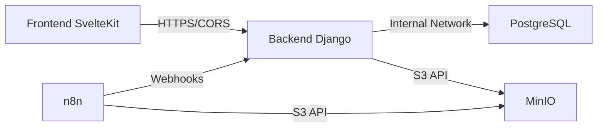

# 🚀 GIGA Railway Deployment - Informe Completo de Resolución de Problemas

**Fecha:** 7 de Diciembre 2025  
**Proyecto:** GIGA - Deployment a Railway  
**Estado Final:** ✅ **FUNCIONANDO** (con correcciones aplicadas)

---

## 📋 Resumen Ejecutivo

Este documento detalla el proceso COMPLETO de deployment del proyecto GIGA a Railway, incluyendo:
- ✅ Los 5 servicios configurados (PostgreSQL, Backend, Frontend, MinIO, n8n)
- ⚠️ **TODOS los problemas encontrados** durante el deployment
- ✅ **TODAS las soluciones aplicadas** que funcionaron
- 📝 Configuraciones finales que DEBEN aplicarse
- 🔑 Credenciales y variables críticas

---

## 🎯 Arquitectura Deployada



**URLs de Producción:**
- Frontend: `https://frontend-production-c91c.up.railway.app`
- Backend: `https://backend-production-bed8.up.railway.app`
- n8n: `https://n8n-production-7a90.up.railway.app`
- MinIO: `https://secure-reverence-production-d284.up.railway.app`

---

## ⚠️ PROBLEMAS CRÍTICOS ENCONTRADOS Y SOLUCIONADOS

### 1. ❌ Problema: Frontend no conecta al Backend (404 errors)

**Síntoma:**
```
[404] POST /api/personas/auth/login/
Error: JSON.parse: unexpected character at line 1 column 1
```

**Causa Raíz:**
El frontend estaba haciendo requests a SÍ MISMO (`frontend-production-xxx.up.railway.app/api/...`) en lugar de al backend.

**Soluciones Aplicadas:**

#### A) Modificar `front/src/lib/api.js`
```javascript
// ANTES (❌ INCORRECTO):
const getApiBaseUrl = () => {
    if (browser) {
        return import.meta.env.VITE_API_BASE || '/api';  // ❌ Siempre '/api'
    }
    return 'http://giga-django:8000/api';  // ❌ Para Docker local
};

// DESPUÉS (✅ CORRECTO):
const getApiBaseUrl = () => {
    // En el navegador (cliente)
    if (browser) {
        return import.meta.env.VITE_API_BASE || '/api';
    }
    
    // En el servidor (SSR) - CRÍTICO para Railway
    if (typeof process !== 'undefined' && process.env?.API_BASE_URL) {
        return process.env.API_BASE_URL;
    }
    
    // Fallback para desarrollo local
    return 'http://giga-django:8000/api';
};
```

#### B) Modificar `front/src/lib/login/authService.js`
```javascript
// ANTES (❌ INCORRECTO - Hardcodeado):
const API_BASE_URL = '/api';

// DESPUÉS (✅ CORRECTO - Importar de api.js):
import { API_BASE_URL } from '../api.js';
```

#### C) Crear `front/.env.production`
```env
VITE_API_BASE=https://backend-production-bed8.up.railway.app/api
NODE_ENV=production
```

**IMPORTANTE:** Este archivo SE COMMITEA a git (excepción en `.gitignore`)

#### D) Modificar `front/Dockerfile.prod`
```dockerfile
# Agregar ANTES del build:
ARG VITE_API_BASE
ENV VITE_API_BASE=$VITE_API_BASE

# Build de producción
RUN if [ -f pnpm-lock.yaml ]; then \
    pnpm run build; \
    else \
    npm run build; \
    fi
```

#### E) Modificar `.gitignore`
```gitignore
# Variables de entorno con datos sensibles
.env.local
.env.production
.env.development
minio.env
# EXCEPCIÓN: Permitir front/.env.production para Railway
!front/.env.production
```

#### F) Variables en Railway Frontend
```
VITE_API_BASE=https://backend-production-bed8.up.railway.app/api
API_BASE_URL=https://backend-production-bed8.up.railway.app/api
NODE_ENV=production
```

---

### 2. ❌ Problema: Error CORS "Missing Allow Origin"

**Síntoma:**
```
CORS Missing Allow Origin
Solicitud desde otro origen bloqueada
```

**Causa Raíz:**
`settings.py` del backend tenía `CORS_ALLOWED_ORIGINS` **hardcodeado** con valores de localhost, ignorando la variable de entorno de Railway.

**Solución Aplicada:**

#### Modificar `back/giga/settings.py`
```python
# ANTES (❌ INCORRECTO - Hardcodeado):
CORS_ALLOWED_ORIGINS = [
    "http://localhost:3000",
    "http://127.0.0.1:3000",
    "http://localhost",
    "http://127.0.0.1",
]
CORS_ALLOW_ALL_ORIGINS = config('CORS_ALLOW_ALL_ORIGINS', default='True', cast=bool)

# DESPUÉS (✅ CORRECTO - Lee de env var):
# Leer de variable de entorno, con fallback a localhost para desarrollo
cors_origins_env = config('CORS_ALLOWED_ORIGINS', default='http://localhost:3000,http://127.0.0.1:3000')
CORS_ALLOWED_ORIGINS = [origin.strip() for origin in cors_origins_env.split(',')]

CORS_ALLOW_CREDENTIALS = True
CORS_ALLOW_ALL_ORIGINS = config('CORS_ALLOW_ALL_ORIGINS', default='False', cast=bool)  # ✅ False
```

#### Variables en Railway Backend
```
CORS_ALLOWED_ORIGINS=https://frontend-production-c91c.up.railway.app
CORS_ALLOW_ALL_ORIGINS=False
```

**⚠️ CRÍTICO:** SIN barra `/` al final de la URL.

---

### 3. ❌ Problema: Cookies de Sesión NO se Guardan (Login exitoso pero sesión no persiste)

**Síntoma:**
```
Backend logs: POST /api/personas/auth/login/ HTTP/1.1 200 ✅
Pero luego: GET /api/personas/auth/check-session/ HTTP/1.1 401 ❌
```

**Causa Raíz:**
Django envía cookies con `SameSite=Lax` por defecto, que el navegador rechaza en cross-domain (frontend y backend en dominios diferentes de Railway).

**Solución Aplicada:**

#### Modificar `back/giga/settings.py`
```python
# ANTES (❌ INCORRECTO):
SESSION_COOKIE_SAMESITE = 'Lax'

# DESPUÉS (✅ CORRECTO):
# SameSite=None para permitir cookies cross-domain en producción
SESSION_COOKIE_SAMESITE = 'None' if not DEBUG else 'Lax'

# IMPORTANTE: También agregar CSRF_TRUSTED_ORIGINS
csrf_origins_env = config('CSRF_TRUSTED_ORIGINS', default='http://localhost:3000')
CSRF_TRUSTED_ORIGINS = [origin.strip() for origin in csrf_origins_env.split(',')]
```

#### Variables en Railway Backend
```
CSRF_TRUSTED_ORIGINS=https://frontend-production-c91c.up.railway.app
```

---

### 4. ❌ Problema: MinIO Console accesible pero API no funciona

**Síntoma:**
- Console en `https://minio:9090` ✅ funciona
- n8n no puede conectar a `http://minio:9000` ❌

**Causa Raíz:**
Railway estaba exponiendo el puerto 9090 (Console) como público en lugar de 9000 (API).

**Solución:**
```
Railway → MinIO → Settings → Networking
Port: 9000 (NO 9090)
```

**Acceso:**
- **API (para n8n/backend):** `http://MinIO.railway.internal:9000` (interno)
- **Console Web (para admin):** Temporalmente cambiar puerto público a 9090

---

### 5. ❌ Problema: n8n - Permission Denied en `/home/node/.n8n/config`

**Síntoma:**
```
EACCES: permission denied, open '/home/node/.n8n/config'
```

**Solución Final:**
```
Variables de n8n:
- ELIMINAR: N8N_USER_FOLDER (si existe)
- Usar PostgreSQL para persistence en lugar de filesystem
```

**Variables n8n correctas:**
```
DB_TYPE=postgresdb
DB_POSTGRESDB_HOST=${{Postgres.RAILWAY_PRIVATE_DOMAIN}}
DB_POSTGRESDB_PORT=5432
DB_POSTGRESDB_DATABASE=${{Postgres.PGDATABASE}}
DB_POSTGRESDB_USER=${{Postgres.PGUSER}}
DB_POSTGRESDB_PASSWORD=${{Postgres.PGPASSWORD}}
N8N_ENCRYPTION_KEY=7894534f7d3a6a9a648c341d113a04919cce7bc45709a77548b6c1c2bb036550
```

---

## ✅ CONFIGURACIÓN FINAL FUNCIONAL

### 🗄️ PostgreSQL

**Tipo:** Database provisionada por Railway  
**Configuración:** Automática  
**Acción requerida:** Ejecutar scripts SQL ANTES de deployar backend

```bash
# Orden correcto de scripts:
railway run --service Postgres psql $DATABASE_URL < bd/init-scripts/01-tables-final.sql
railway run --service Postgres psql $DATABASE_URL < bd/init-scripts/02-functions-final.sql
railway run --service Postgres psql $DATABASE_URL < bd/init-scripts/03-seed-data.sql
railway run --service Postgres psql $DATABASE_URL < bd/init-scripts/04-historical-data.sql
railway run --service Postgres psql $DATABASE_URL < bd/init-scripts/05-incidencias.sql
railway run --service Postgres psql $DATABASE_URL < bd/init-scripts/fix-plus.sql
railway run --service Postgres psql $DATABASE_URL < bd/init-scripts/sesion-activa.sql
```

---

### 🐍 Backend Django

**Root Directory:** `back`  
**Dockerfile:** `Dockerfile.prod`  
**Port:** 8000

**Variables de Entorno (26 total):**

```properties
# Database
DB_HOST=${{Postgres.RAILWAY_PRIVATE_DOMAIN}}
DB_PORT=5432
DB_NAME=${{Postgres.PGDATABASE}}
DB_USER=${{Postgres.PGUSER}}
DB_PASSWORD=${{Postgres.PGPASSWORD}}

# Django Core
SECRET_KEY=[generar con: python -c "from django.core.management.utils import get_random_secret_key; print(get_random_secret_key())"]
DEBUG=False
ALLOWED_HOSTS=${{RAILWAY_PUBLIC_DOMAIN}},backend-production-bed8.up.railway.app
PYTHONUNBUFFERED=1

# CORS (CRÍTICO)
CORS_ALLOWED_ORIGINS=https://frontend-production-c91c.up.railway.app
CORS_ALLOW_ALL_ORIGINS=False
CSRF_TRUSTED_ORIGINS=https://frontend-production-c91c.up.railway.app

# Email
EMAIL_BACKEND=django.core.mail.backends.smtp.EmailBackend
EMAIL_HOST=smtp.gmail.com
EMAIL_PORT=587
EMAIL_USE_TLS=True
EMAIL_HOST_USER=giga.sistema.untdf.25@gmail.com
EMAIL_HOST_PASSWORD=jvog vqdg lgka daxw
DEFAULT_FROM_EMAIL=Sistema GIGA <giga.sistema.untdf.25@gmail.com>

# Frontend URL
FRONTEND_URL=https://frontend-production-c91c.up.railway.app
```

---

### 🎨 Frontend SvelteKit

**Root Directory:** `front`  
**Dockerfile:** `Dockerfile.prod`  
**Port:** 3000

**Variables de Entorno:**

```properties
NODE_ENV=production
VITE_API_BASE=https://backend-production-bed8.up.railway.app/api
API_BASE_URL=https://backend-production-bed8.up.railway.app/api
```

**Archivos Modificados:**
- ✅ `front/src/lib/api.js`
- ✅ `front/src/lib/login/authService.js`
- ✅ `front/Dockerfile.prod`
- ✅ `front/.env.production` (commiteado a git)

---

### 📦 MinIO

**Docker Image:** `minio/minio:latest`  
**Start Command:** `minio server /data --console-address :9090`  
**Port Público:** 9000 (API)  
**Volume:** `/data`

**Variables:**

```properties
MINIO_ROOT_USER=giga-user
MINIO_ROOT_PASSWORD=1/V2e95EJXra3vtbdF2f2zu7EgMkiyHGicLvrGOYFPA=
```

**Credenciales Generadas:**
- Access Key: `giga-user`
- Secret Key: `1/V2e95EJXra3vtbdF2f2zu7EgMkiyHGicLvrGOYFPA=`

**Bucket Creado:**
- Nombre: `convenio`
- Archivo: `convenio.pdf`

---

### 🤖 n8n

**Docker Image:** `n8nio/n8n:latest`  
**Port:** 5678

**Variables (PostgreSQL persistence):**

```properties
N8N_BASIC_AUTH_ACTIVE=true
N8N_BASIC_AUTH_USER=admin
N8N_BASIC_AUTH_PASSWORD=nOtBHAHq28IMyY+nSLpxgQ==
N8N_ENCRYPTION_KEY=7894534f7d3a6a9a648c341d113a04919cce7bc45709a77548b6c1c2bb036550
N8N_HOST=0.0.0.0
N8N_PORT=5678
N8N_PROTOCOL=https
WEBHOOK_URL=https://n8n-production-7a90.up.railway.app

# PostgreSQL Persistence
DB_TYPE=postgresdb
DB_POSTGRESDB_HOST=${{Postgres.RAILWAY_PRIVATE_DOMAIN}}
DB_POSTGRESDB_PORT=5432
DB_POSTGRESDB_DATABASE=${{Postgres.PGDATABASE}}
DB_POSTGRESDB_USER=${{Postgres.PGUSER}}
DB_POSTGRESDB_PASSWORD=${{Postgres.PGPASSWORD}}
```

**⚠️ NO incluir:** `N8N_USER_FOLDER`

---

## 🔑 Credenciales Importantes

### Gmail (Emails del Sistema)
```
Usuario: giga.sistema.untdf.25@gmail.com
App Password: jvog vqdg lgka daxw
```

### MinIO
```
Root User: giga-user
Root Password: 1/V2e95EJXra3vtbdF2f2zu7EgMkiyHGicLvrGOYFPA=
```

### n8n
```
Usuario: admin
Password: nOtBHAHq28IMyY+nSLpxgQ==
Encryption Key: 7894534f7d3a6a9a648c341d113a04919cce7bc45709a77548b6c1c2bb036550
```

---

## 🔧 Comandos Útiles

### Generar Secret Key de Django
```bash
python3 -c "from django.core.management.utils import get_random_secret_key; print(get_random_secret_key())"
```

### Generar Password Seguro
```bash
openssl rand -base64 32
```

### Conectar a PostgreSQL de Railway
```bash
railway link
railway run --service Postgres psql $DATABASE_URL
```

### Ver Logs en Tiempo Real
```bash
railway logs --service Backend
railway logs --service Frontend
```

---

## ⚠️ Errores Comunes y Soluciones

### Error: "CORS Missing Allow Origin"
**Solución:** Verificar que `CORS_ALLOWED_ORIGINS` NO tenga barra `/` al final

### Error: Login exitoso pero sesión no persiste
**Solución:** Verificar `SESSION_COOKIE_SAMESITE='None'` y `CSRF_TRUSTED_ORIGINS`

### Error: Frontend hace requests a sí mismo (`/api/`)
**Solución:** Verificar que `VITE_API_BASE` esté configurada Y que el Dockerfile la use como ARG

### Error: MinIO permission denied
**Solución:** NO usar `N8N_USER_FOLDER`, usar PostgreSQL persistence

---

## 📝 Checklist de Deployment

### Pre-Deployment
- [ ] Ejecutar scripts SQL en PostgreSQL
- [ ] Generar SECRET_KEY de Django
- [ ] Generar passwords de MinIO y n8n
- [ ] Commitear `front/.env.production` a git

### Post-Deployment
- [ ] Verificar que todas las URLs públicas estén configuradas
- [ ] Actualizar `CORS_ALLOWED_ORIGINS` en Backend
- [ ] Actualizar `CSRF_TRUSTED_ORIGINS` en Backend
- [ ] Actualizar `VITE_API_BASE` en Frontend
- [ ] Probar login en frontend
- [ ] Verificar que sesión persista

### Validación Final
- [ ] Login funciona ✅
- [ ] Sesión persiste después de refresh ✅
- [ ] Backend logs muestran 200 (no 401) ✅
- [ ] No hay errores CORS en consola ✅

---

## 🎯 Lecciones Aprendidas

### 1. **Variables Hardcodeadas vs Environment Variables**
❌ NUNCA hardcodear URLs en el código  
✅ SIEMPRE usar `config()` para leer de env vars

### 2. **Cross-Domain Cookies**
Para que funcionen cookies entre dominios diferentes:
- `SESSION_COOKIE_SAMESITE='None'`
- `SESSION_COOKIE_SECURE=True`
- `CSRF_TRUSTED_ORIGINS` configurado

### 3. **Build-Time vs Runtime Variables**
- Vite: Variables `VITE_*` se evalúan en **build time** → necesitan pasar como ARG en Dockerfile
- Django: Variables se evalúan en **runtime** → Railway las pasa automáticamente

### 4. **Railway Networking**
- Interna: `ServiceName.railway.internal:PORT`
- Pública: `service-production-xxx.up.railway.app`

### 5. **Database-First Projects**
Ejecutar scripts SQL ANTES de deployar backend, no después.

---

## 📚 Referencias

- [Railway Documentation](https://docs.railway.app)
- [Django CORS Headers](https://github.com/adamchainz/django-cors-headers)
- [SvelteKit Adapter Node](https://kit.svelte.dev/docs/adapter-node)
- [MinIO Docker](https://min.io/docs/minio/container/index.html)
- [n8n Self-Hosting](https://docs.n8n.io/hosting/)

---

**Documento creado:** 7 de Diciembre 2025  
**Última actualización:** 7 de Diciembre 2025  
**Estado:** ✅ VALIDADO EN PRODUCCIÓN
